<picture>
  
</picture>

<div align="center">

[](https://blobpack.oliverprojects.tech)

<br/>


</div>

<br/>

---

<br/>

<table border="0" cellspacing="0" cellpadding="0">
<tr>
<td width="60%" valign="top">

### `👋` About

I design and build products end-to-end — from 3D renders in Blender to full-stack apps on a VPS.

Everything I ship has to look exceptional and work flawlessly.
I don't do generic. I don't do half-baked.

Currently focused on **[Lil' Blob Pack](https://blobpack.oliverprojects.tech)** — a growing collection of free 3D mascots for your favourite apps.

Building in public. Always cooking something new.

</td>
<td width="40%" valign="top" align="center">

<a href="https://github.com/csiklaoliver">

</a>

<a href="https://github.com/csiklaoliver">

</a>

</td>
</tr>
</table>

<br/>

---

<br/>

## `🏆` Trophies

<div align="center">

[](https://github.com/csiklaoliver)

</div>

<br/>

---

<br/>

## `✦` Featured — Lil' Blob Pack

<br/>

<div align="center">

> **Free 3D mascots for your favourite apps.**<br/>FBX + GLB. No credit required. No paywalls. Just download and use.

<br/>

[](https://blobpack.oliverprojects.tech)&nbsp;&nbsp;[](https://github.com/Csiklaoliver/lilblobpack-source)&nbsp;&nbsp;[](https://github.com/Csiklaoliver/lil-blob-pack)&nbsp;&nbsp;

<br/>

`Next.js 16` `TypeScript` `Tailwind CSS` `Blender` `NextAuth` `PM2` `Nginx` `GitHub Actions`

</div>

<br/>

---

<br/>

## `🔨` In the Workshop

<br/>

<table border="0" cellspacing="0" cellpadding="16" width="100%">
<tr>

<td width="50%" valign="top">

#### 🎬 &nbsp; Pixel Cinema

A cinematic movie discovery experience.
Because browsing movies should feel like going to the cinema.


</td>

<td width="50%" valign="top">

#### 📞 &nbsp; Call Anybody

Real-time calling. Minimal, fast, no fluff.
Because sometimes you just need to talk.


</td>

</tr>
</table>

<br/>

---

<br/>

## `⚡` Stack

<br/>

<div align="center">

[](https://skillicons.dev)

<br/><br/>


</div>

<br/>

---

<br/>

## `📊` Activity

<br/>

<div align="center">

<a href="https://github.com/csiklaoliver">

</a>

</div>

<br/>

---

<br/>

## `🐍` Contributions

<div align="center">

<picture>
  <source media="(prefers-color-scheme: dark)" srcset="https://raw.githubusercontent.com/csiklaoliver/csiklaoliver/output/snake-dark.svg" />
  
</picture>

</div>

<br/>

---

<br/>

<div align="center">

📬 &nbsp; **[info@oliverprojects.tech](mailto:info@oliverprojects.tech)** &nbsp; · &nbsp; 🌐 &nbsp; **[oliverprojects.tech](https://oliverprojects.tech)** &nbsp; · &nbsp; 🫧 &nbsp; **[blobpack.oliverprojects.tech](https://blobpack.oliverprojects.tech)**

<br/><br/>

```
always shipping · never settling · hungary 🇭🇺
```

<br/>


</div>
